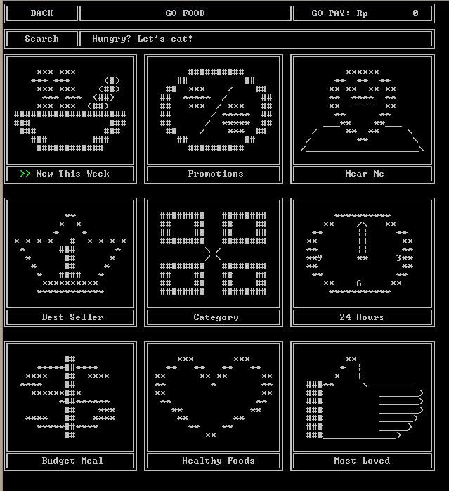
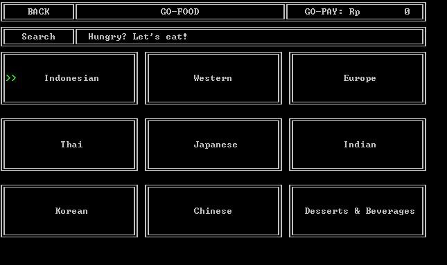
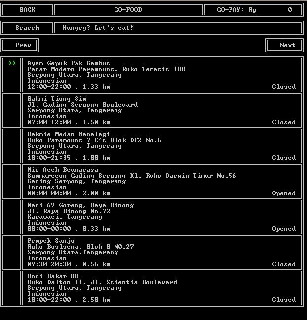
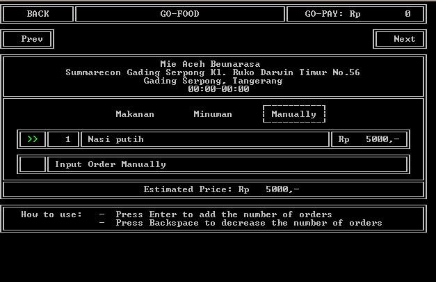
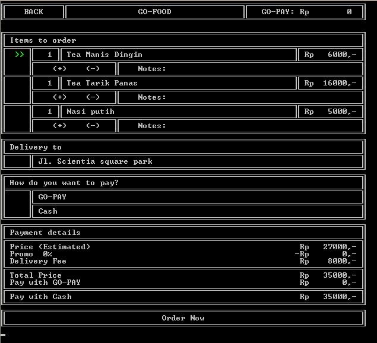
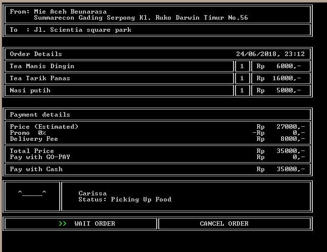
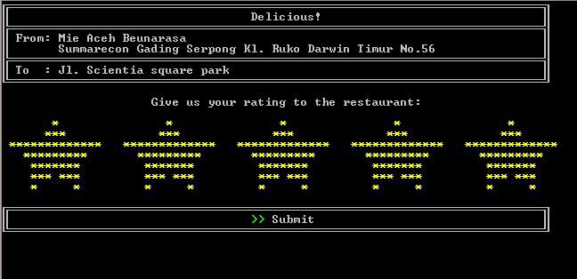
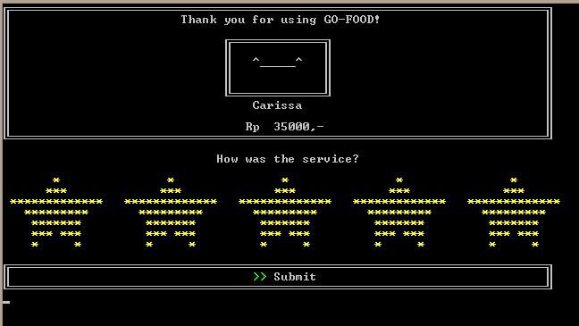

## Go-Food
Console application insipired by Go-Food for online food delivery built using C.

## Features
* Login and Register
  * Login and register users data to the app
* Home
  * Filter restaurants by category, search restaurants, and top up balance
* Restaurant Detail
  * Show selected restaurant details and menu (foods, beverages, and manually inputted menu)
* Payment
  * Confirm selected menu to be ordered 
* Rating
  * Give ratings to the ordered restaurant

## Demo

 

  

 

 

  

 

 

  

 

 

  

 

 

  

 

 

  

 

 

  

 

 

  

 

 

  

 

## Contributors
* Benny Richardson
* Kevin Hendy
* Ventryshia Andiyani
* Wilson Philips
